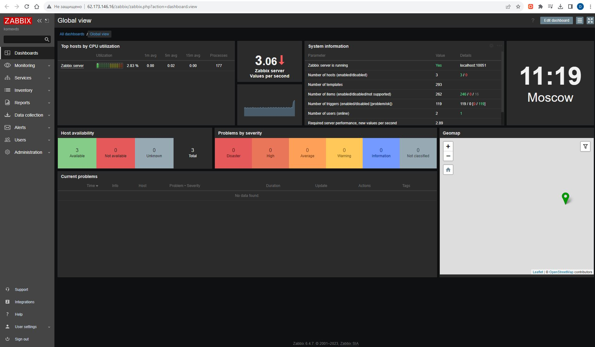
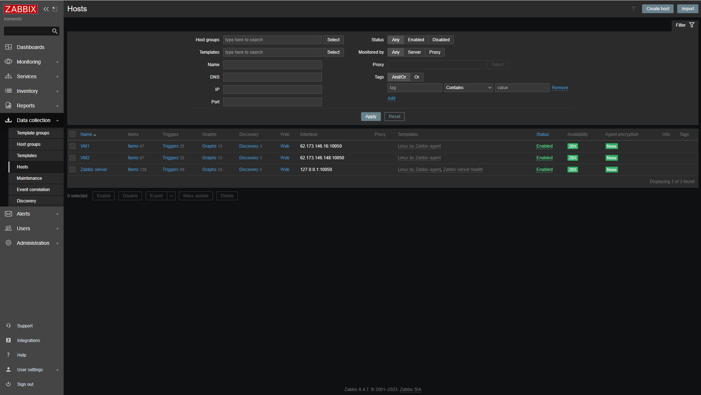
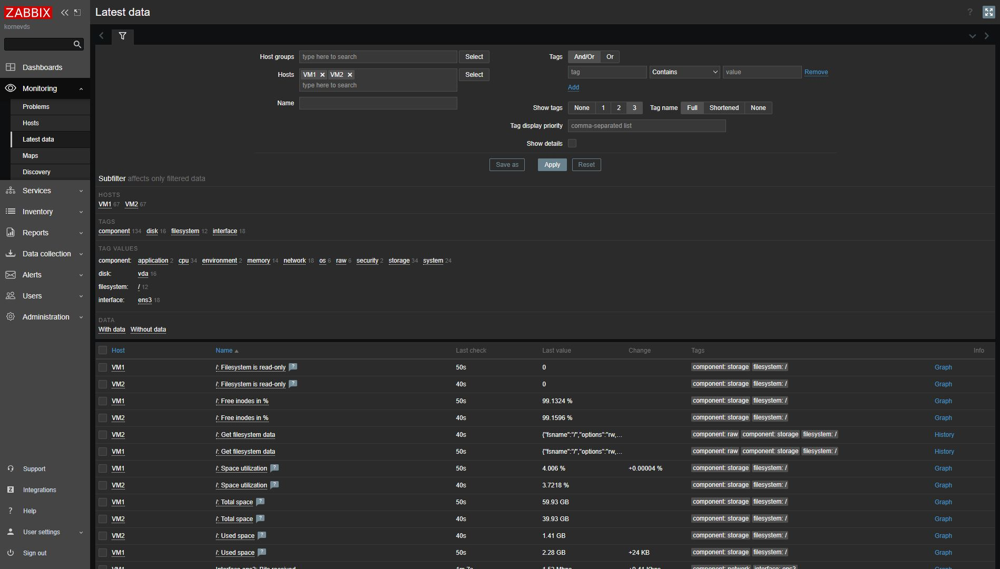

# Домашнее задание к занятию «Система мониторинга Zabbix»

В практике есть 2 основных и 1 дополнительное (со звездочкой) задания. Первые два нужно выполнять обязательно, третье - по желанию и его решение никак не повлияет на получение вами зачета по этому домашнему заданию, при этом вы сможете глубже и/или шире разобраться в материале. 

Пожалуйста, присылайте на проверку всю задачу сразу. Любые вопросы по решению задач задавайте в чате учебной группы.

### Цели задания
1. Научиться устанавливать Zabbix Server c веб-интерфейсом
2. Научиться устанавливать Zabbix Agent на хосты
3. Научиться устанавливать Zabbix Agent на компьютер и подключать его к серверу Zabbix 

### Чеклист готовности к домашнему заданию
- [ ] Просмотрите в личном кабинете занятие "Система мониторинга Zabbix" 

### Инструкция по выполнению домашнего задания

1. Сделайте fork [репозитория c шаблоном решения](https://github.com/netology-code/sys-pattern-homework) к себе в Github и переименуйте его по названию или номеру занятия, например, https://github.com/имя-вашего-репозитория/gitlab-hw или https://github.com/имя-вашего-репозитория/8-03-hw).
2. Выполните клонирование этого репозитория к себе на ПК с помощью команды `git clone`.
3. Выполните домашнее задание и заполните у себя локально этот файл README.md:
   - впишите вверху название занятия и ваши фамилию и имя;
   - в каждом задании добавьте решение в требуемом виде: текст/код/скриншоты/ссылка;
   - для корректного добавления скриншотов воспользуйтесь инструкцией [«Как вставить скриншот в шаблон с решением»](https://github.com/netology-code/sys-pattern-homework/blob/main/screen-instruction.md);
   - при оформлении используйте возможности языка разметки md. Коротко об этом можно посмотреть в [инструкции по MarkDown](https://github.com/netology-code/sys-pattern-homework/blob/main/md-instruction.md).
4. После завершения работы над домашним заданием сделайте коммит (`git commit -m "comment"`) и отправьте его на Github (`git push origin`).
5. Для проверки домашнего задания преподавателем в личном кабинете прикрепите и отправьте ссылку на решение в виде md-файла в вашем Github.
6. Любые вопросы задавайте в чате учебной группы и/или в разделе «Вопросы по заданию» в личном кабинете.

---

### Задание 1 

Установите Zabbix Server с веб-интерфейсом.

#### Процесс выполнения
1. Выполняя ДЗ, сверяйтесь с процессом отражённым в записи лекции.
2. Установите PostgreSQL. Для установки достаточна та версия, что есть в системном репозитороии Debian 11.
3. Пользуясь конфигуратором команд с официального сайта, составьте набор команд для установки последней версии Zabbix с поддержкой PostgreSQL и Apache.
4. Выполните все необходимые команды для установки Zabbix Server и Zabbix Web Server.

#### Требования к результаты 
1. Прикрепите в файл README.md скриншот авторизации в админке.
   
2. Приложите в файл README.md текст использованных команд в GitHub.

Примечание о проблемах при установке:

При простой установке Postgres и создании базы данных, она создаётся не в кодировке UTF-8 и нужно сначала изменить template1 шаблон в psql на кодировку UTF-8, чтобы команды в задании сработали как нужно.
Также была проблема с дефолтной кодировкой в ОС, пришлось редактировать файл /etc/locale.gen, раскомментить UTF-8 и сделать locale-gen
```
    3  sudo apt install postgresql
    4  apt install postgresql
    5  apt update
    6  apt install postgresql
    7  apt install sudo
    8  su postgres
    9  wget https://repo.zabbix.com/zabbix/6.4/debian/pool/main/z/zabbix-release/zabbix-release_6.4-1+debian11_all.deb
   10  dpkg -i zabbix-release_6.4-1+debian11_all.deb
   11  apt update
   12  apt install zabbix-server-pgsql zabbix-frontend-php php7.4-pgsql zabbix-apache-conf zabbix-sql-scripts zabbix-agent
   13  sudo -u postgres createuser --pwprompt zabbix
   14  sudo -u postgres createdb -O zabbix zabbix
   15  zcat /usr/share/zabbix-sql-scripts/postgresql/server.sql.gz | sudo -u zabbix psql zabbix
   16  sed -i 's/# DBPassword=/DBPassword=123456789/g' /etc/zabbix/zabbix_server.conf
   17  systemctl restart zabbix-server zabbix-agent apache2
   18  systemctl enable zabbix-server zabbix-agent apache2
   19  ip a
   20  locale -a
   21  nano /etc/locale.gen
   22  locale-gen
   23  systemctl restart zabbix-server zabbix-agent apache2

```

---

### Задание 2 

Установите Zabbix Agent на два хоста.

#### Процесс выполнения
1. Выполняя ДЗ, сверяйтесь с процессом отражённым в записи лекции.
2. Установите Zabbix Agent на 2 вирт.машины, одной из них может быть ваш Zabbix Server.
3. Добавьте Zabbix Server в список разрешенных серверов ваших Zabbix Agentов.
4. Добавьте Zabbix Agentов в раздел Configuration > Hosts вашего Zabbix Servera.
5. Проверьте, что в разделе Latest Data начали появляться данные с добавленных агентов.

#### Требования к результаты 
1. Приложите в файл README.md скриншот раздела Configuration > Hosts, где видно, что агенты подключены к серверу

2. Приложите в файл README.md скриншот лога zabbix agent, где видно, что он работает с сервером
```
root@kornev:~# tail -f /var/log/zabbix/zabbix_agentd.log
  3660:20231019:111604.899 agent #0 started [main process]
  3661:20231019:111604.900 agent #1 started [collector]
  3662:20231019:111604.900 agent #2 started [listener #1]
  3665:20231019:111604.901 agent #5 started [active checks #1]
  3664:20231019:111604.903 agent #4 started [listener #3]
  3665:20231019:111604.904 Unable to connect to [127.0.0.1]:10051 [cannot connect to [[127.0.0.1]:10051]: [111] Connection refused]
  3665:20231019:111604.904 Unable to send heartbeat message to [127.0.0.1]:10051 [cannot connect to [[127.0.0.1]:10051]: [111] Connection refused]
  3665:20231019:111604.904 Unable to connect to [127.0.0.1]:10051 [cannot connect to [[127.0.0.1]:10051]: [111] Connection refused]
  3665:20231019:111604.904 Active check configuration update started to fail
  3663:20231019:111604.904 agent #3 started [listener #2]

```
3. Приложите в файл README.md скриншот раздела Monitoring > Latest data для обоих хостов, где видны поступающие от агентов данные.

4. Приложите в файл README.md текст использованных команд в GitHub
```
root@kornev:~# history
    1  apt update
    2  wget https://repo.zabbix.com/zabbix/6.4/debian/pool/main/z/zabbix-release/zabbix-release_6.4-1+debian11_all.deb
    3  dpkg -i zabbix-release_6.4-1+debian11_all.deb
    4  apt update
    5  apt install zabbix-agent
    6  systemctl restart zabbix-agent
    7  systemctl enable zabbix-agent
    8  sed -i 's/Server=127.0.0.1/Server=127.0.0.1,62.173.146.16,62.173.146.148'/g' /etc/zabbix/zabbix_agentd.conf
    9  systemctl restart zabbix-agent
```

---
## Задание 3 со звёздочкой*
Установите Zabbix Agent на Windows (компьютер) и подключите его к серверу Zabbix.

#### Требования к результаты 
1. Приложите в файл README.md скриншот раздела Latest Data, где видно свободное место на диске C:
--- 

## Критерии оценки

1. Выполнено минимум 2 обязательных задания
2. Прикреплены требуемые скриншоты и тексты 
3. Задание оформлено в шаблоне с решением и опубликовано на GitHub


